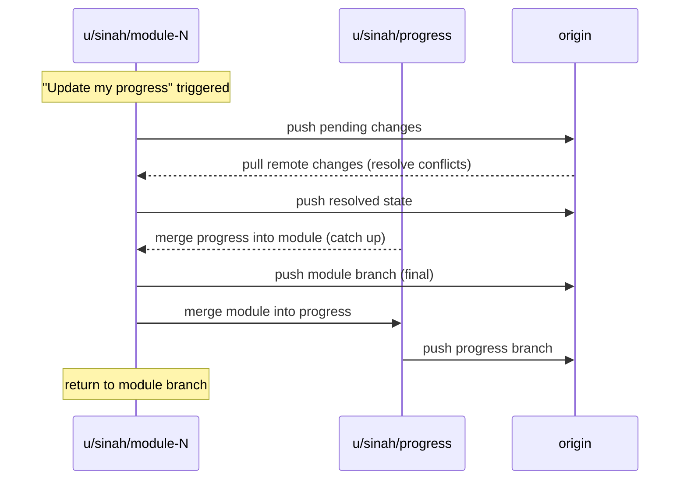

# AI Learning — Sina
# Repository: https://github.com/chaoticsoftware/learning

## What This Is
A structured, self-paced AI mastery curriculum for a veteran software engineer.
12 modules covering the full AI practitioner stack — taught interactively with Claude,
tracked in git, resumable on any device.

---

## Table of Contents
1. [Quick Start on a New Device](#quick-start-on-a-new-device)
2. [Git Workflow](#git-workflow)
3. [Session Protocol](#session-protocol)
4. [Client Device Setup](#client-device-setup)
5. [File Structure](#file-structure)
6. [Module List](#module-list)

---

## Quick Start on a New Device

```bash
git clone https://github.com/chaoticsoftware/learning.git
cd learning
git checkout u/sinah/progress        # active learning branch
git pull
```

Then open Claude Code in that directory and say:

```
Resume my AI learning.
```

Claude reads the current branch and `PROGRESS.md` and picks up where you left off.

---

## Git Workflow

### Branch hierarchy

```
main
├── u/sinah/(topic)      # program/curriculum changes → merged to main → deleted
├── u/sinah/progress     # ongoing learning progress — NOT auto-merged to main
└── u/sinah/module-N     # per-module work, branched from progress → merged to progress on demand
```

**`main`** — stable, finalized state. Curriculum structure, finalized topic notes,
infrastructure files. Only updated via explicit merges.

**`u/sinah/progress`** — Sina's ongoing progress. `PROGRESS.md` lives here.
Not merged to main automatically — only on demand.

**`u/sinah/module-N`** — active work branch for a specific module.
Branched from `u/sinah/progress` at the start of each module.
Merged back to `u/sinah/progress` on demand via "Update my progress".

> **Note:** Git does not allow a branch and a branch that is a path-prefix of it
> to coexist (e.g., `u/sinah/progress` and `u/sinah/progress/module-1` cannot
> both exist). Module branches therefore live at `u/sinah/module-N`, not nested
> under `progress/`.

**`u/sinah/(topic)`** — short-lived branches for program or curriculum changes
(e.g., `u/sinah/workflow-setup`, `u/sinah/add-module-7`). Merged to `main`
when finalized, then deleted.

### Commit message conventions

| Prefix | Use for | Example |
|--------|---------|---------|
| `learn(module-N):` | New teaching content in `topics/` | `learn(module-2): prompt engineering with CoT diagrams` |
| `progress(module-N):` | Session update to `PROGRESS.md` | `progress(module-2): completed few-shot section` |
| `exercise(module-N):` | Code added/updated in `exercises/` | `exercise(module-4): tool use loop with calculator` |
| `drill(module-Na):` | Drill-down sub-topic file | `drill(module-1a): attention mechanism deep dive` |
| `meta:` | README, MASTER_PROMPT, LEARNING_PLAN, .gitignore | `meta: update branch workflow` |

### Merging rules

| From | To | When |
|------|----|------|
| `u/sinah/module-N` | `u/sinah/progress` | On demand: "Update my progress" |
| `u/sinah/progress` | `main` | On demand: user requests it |
| `u/sinah/(topic)` | `main` | When finalized — then delete branch |

### Auto-save (every prompt)
After completing each prompt response, Claude commits and pushes all pending changes
to the current branch. This ensures no work is lost between prompts.

### "Update my progress" flow

Say **"Update my progress"** at any point during a module session. Claude will:

1. Commit and push all pending changes on the current module branch
2. Pull any remote changes to the module branch; resolve conflicts if needed; push
3. Merge `u/sinah/progress` into the module branch (catch up with any progress-level changes)
4. Push the module branch one final time
5. Switch to `u/sinah/progress`, merge the module branch in, push
6. Switch back to `u/sinah/module-N`



### What lives in git / what doesn't

| Committed | Gitignored |
|-----------|------------|
| All `.md` teaching and progress notes | `.env`, API keys |
| All exercise source code | `node_modules/`, `.venv/` |
| `PROGRESS.md` | Model weight files (`.bin`, `.gguf`, `.safetensors`) |
| `MASTER_PROMPT.md` versions | IDE workspace files (`.idea/`, `.vscode/`) |

---

## Session Protocol

### Starting a session (Claude does this automatically)

1. Check current branch
2. If on `u/sinah/progress/module-N` → pull latest, read `PROGRESS.md`, continue
3. If on `u/sinah/progress` or `main` → read `PROGRESS.md`, ask what to work on,
   check out or create the appropriate module branch

### Ending a session (Claude does this automatically)

```bash
git add -A
git commit -m "progress(module-N): <what was covered>"
git push
```

### Cross-device sync

```bash
# On the other device
git fetch --all
git checkout u/sinah/module-N    # whichever is active — check PROGRESS.md
git pull
```

---

## Client Device Setup

### Core requirements

| Tool | Purpose | Install |
|------|---------|---------|
| **git** | Version control | [git-scm.com](https://git-scm.com) |
| **Claude Code** | Primary AI facilitator | `npm install -g @anthropic-ai/claude-code` |
| **Node.js 22 LTS** | Claude Code + JS exercises | via `fnm` (see below) |
| **Python 3.11+** | AI library exercises | via `uv` (see below) |

### IDE — VSCode (recommended)

| Extension | Why |
|-----------|-----|
| **Markdown Preview Enhanced** | Renders Mermaid diagrams — essential for topic files |
| **Python** (Microsoft) | Linting, IntelliSense |
| **Pylance** | Fast type checking |
| **GitLens** | Rich git history, blame, diffs |
| **GitHub Copilot** | Already in use; keep for comparison exercises |
| **REST Client** | Test API calls from `.http` files (Module 3+) |
| **Jupyter** | Notebooks for Module 10 |

```json
// .vscode/settings.json (recommended)
{
  "editor.wordWrap": "on",
  "markdown.preview.breaks": true,
  "files.autoSave": "onFocusChange"
}
```

### Alternative IDEs

| IDE | When to prefer |
|-----|----------------|
| **Cursor** | Want AI-native coding as a first-class IDE feature; good companion to this curriculum |
| **Zed** | Value raw performance and minimalism; has built-in Claude integration |
| **JetBrains PyCharm** | If exercises grow into large Python projects |

**Cursor** is worth trying alongside this curriculum — it's a live demonstration of
AI-assisted development that becomes relevant in Module 12.

### Python setup

```bash
# Install uv (fast package manager — preferred over pip/conda)
curl -LsSf https://astral.sh/uv/install.sh | sh

# Create venv in the repo
cd ~/learning
uv venv
source .venv/bin/activate        # macOS/Linux
.venv\Scripts\activate           # Windows

# Core packages (add more per module)
uv pip install anthropic openai python-dotenv httpx
```

### Node.js setup

```bash
# fnm — fast Node version manager
curl -fsSL https://fnm.vercel.app/install | bash
fnm install 22 && fnm use 22
node --version   # v22.x
```

### API keys

Create `.env` in the repo root (gitignored):

```bash
ANTHROPIC_API_KEY=sk-ant-...    # console.anthropic.com — needed from Module 3
OPENAI_API_KEY=sk-...           # optional, for cross-model comparison
```

```python
from dotenv import load_dotenv
import os
load_dotenv()
key = os.getenv("ANTHROPIC_API_KEY")
```

### Mermaid rendering

| Method | Setup |
|--------|-------|
| **GitHub** | Zero setup — renders in repo UI automatically |
| **VSCode + Markdown Preview Enhanced** | Right-click `.md` → Open Preview |
| **Obsidian** | Enable Mermaid plugin |

### Platform notes

**Windows:** Use WSL2 for the best shell experience. Install Windows Terminal.
Git credential manager is bundled with Git for Windows.

**macOS:**
```bash
/bin/bash -c "$(curl -fsSL https://raw.githubusercontent.com/Homebrew/install/HEAD/install.sh)"
brew install git python@3.12
```

**Linux (Ubuntu/Debian):**
```bash
sudo apt update && sudo apt install -y git python3 python3-pip python3-venv
# Then install fnm for Node (apt version is too old)
curl -fsSL https://fnm.vercel.app/install | bash
```

---

## File Structure

```
learning/
├── .gitignore
├── README.md                    ← you are here
├── LEARNING_PLAN.md             ← full 12-module curriculum
├── MASTER_PROMPT.md             ← reproduce this on any AI tool
├── PROGRESS.md                  ← session log and per-module status
├── topics/                      ← teaching material, one file per module
│   ├── 01-llm-foundations.md
│   └── ...
└── exercises/                   ← hands-on code, one dir per module
    ├── module-01/
    └── ...
```

---

## Module List

| # | Module | Status |
|---|--------|--------|
| 1 | LLM Foundations | In progress |
| 2 | Prompt Engineering | Not started |
| 3 | AI APIs & SDKs | Not started |
| 4 | Tool Use & Function Calling | Not started |
| 5 | AI Agents | Not started |
| 6 | Model Context Protocol (MCP) | Not started |
| 7 | RAG & Knowledge Systems | Not started |
| 8 | Multi-Agent Systems | Not started |
| 9 | Evals & Testing | Not started |
| 10 | Fine-tuning & Customization | Not started |
| 11 | Production AI Systems | Not started |
| 12 | Frontier Topics | Not started |

See `PROGRESS.md` for detailed status and session log.
