# Module 1: LLM Foundations

> **Status:** In progress | **Started:** 2026-03-05
> **Prereqs:** None | **Next:** Module 2 — Prompt Engineering

---

## Table of Contents
1. [What is an LLM?](#1-what-is-an-llm)
2. [Transformers & Attention](#2-transformers--attention)
3. [Tokenization](#3-tokenization)
4. [Embeddings](#4-embeddings)
5. [How Training Works](#5-how-training-works)
6. [Model Families](#6-model-families)
7. [Capabilities & Limitations](#7-capabilities--limitations)
8. [Multimodality](#8-multimodality)
9. [Summary & Key Takeaways](#9-summary--key-takeaways)

---

## 1. What is an LLM?

At its core, an LLM is a **next-token predictor**. Given a sequence of tokens, it predicts what token comes next. Everything you experience — reasoning, code generation, conversation — is an emergent behavior of doing that one thing extremely well, at enormous scale.

```
f(token_1, token_2, ..., token_n) → probability distribution over all possible next tokens
```

The model doesn't "know" things the way you know things. It has learned statistical patterns from trillions of tokens of text — and those patterns are good enough to appear indistinguishable from understanding.

### The generation loop

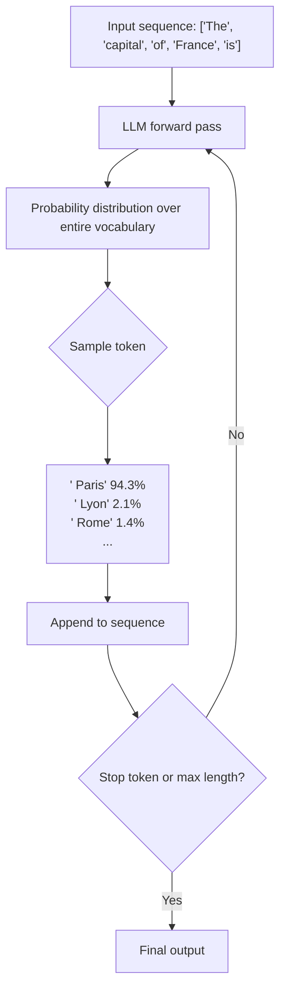

The token chosen at each step is fed back in as input — hence "autoregressive." The model never sees ahead; it only ever predicts one token at a time.

---

## 2. Transformers & Attention

The architecture behind all modern LLMs is the **Transformer**, introduced in the 2017 paper "Attention Is All You Need."

### The problem transformers solved

Before transformers, RNNs processed text **sequentially** — finish word N, then start word N+1. By the end of a long sentence, early context was degraded or lost. Transformers solved this by processing **all tokens simultaneously** and letting every token attend directly to every other token.

### Self-attention — intuition

When processing the word "bank" in "I deposited money at the bank," the model needs to know which other words are relevant to interpreting it. Self-attention computes an **importance weight** between every pair of tokens.

```
Attention weights when the model processes "bank":

 "I"          0.02  ░░
 "deposited"  0.31  ████████
 "money"      0.38  ██████████
 "at"         0.04  ░░
 "the"        0.03  ░░
 "bank"       0.22  ██████

"bank" heavily attends to "deposited" and "money"
→ disambiguates to financial institution, not a river bank
```

For an engineer: every token is a node in a fully connected weighted graph. The model learns which weights matter — by context, not by position.

### Multi-head attention

Instead of one attention operation, transformers run several in parallel. Each "head" specializes in tracking different types of relationships:

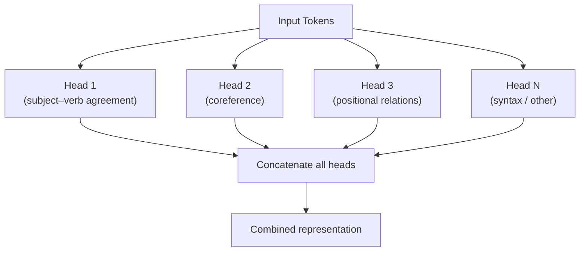

### Transformer block — one layer

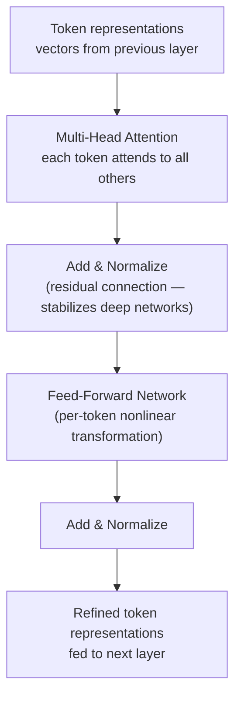

Modern LLMs stack **32–96+ of these blocks**. Early layers learn syntax; middle layers semantics; deep layers abstract reasoning patterns.

### Why transformers scaled

- **Parallelism during training** — all tokens processed simultaneously → full GPU utilization
- **Direct long-range attention** — no degradation over distance
- **Predictable scaling** — more parameters + more data = reliably better (the scaling laws)

---

## 3. Tokenization

Tokens are not characters, not words — they are **subword units** chosen to balance vocabulary size and coverage.

Modern LLMs use **Byte Pair Encoding (BPE)**:
1. Start with individual characters
2. Repeatedly merge the most frequent adjacent pair into a new token
3. Stop when vocabulary reaches target size (~50K–100K tokens)

### What tokenization looks like

```
Text:  "Hello, world! Refactoring is fun."
       │
       ▼  (approximate — varies by model)
Tokens: ["Hello", ",", " world", "!", " Re", "factor", "ing", " is", " fun", "."]
Count:   1         2    3         4    5      6          7      8     9       10

Code:  "def calculate_total(items):"
       │
       ▼
Tokens: ["def", " calculate", "_", "total", "(", "items", "):"]
```

### Token cost intuition

```
Content type        Approx. tokens         Notes
──────────────────  ─────────────────────  ──────────────────────────────────
English prose       1 token / 4 chars      ~750 words per 1,000 tokens
Source code         1 token / 3–4 chars    Keywords efficient; indent costly
Chinese / Japanese  2–3x vs. English       Same idea = more tokens = more cost
Numbers             unpredictable splits   "12345" → ["123","45"] — 2 tokens
Repeated spaces     each may be a token    Avoid unnecessary whitespace

1,000 tokens ≈ 750 English words ≈ 1.5 pages of prose
```

### Tokenization edge cases

| Input | Issue | Impact |
|-------|-------|--------|
| `12345 + 67890` | Numbers split unpredictably | LLMs are bad at arithmetic — use a tool |
| `UPPERCASE` | Often fewer tokens than lowercase | Affects token boundaries, minor cost difference |
| `" hello"` vs `"hello"` | Leading space = different token | Affects completion at sentence starts |
| Rare proper nouns | Spelled out character-by-character | More expensive and less reliable |
| Repeated whitespace | Each space can be a token | Wastes token budget |

### Context window = token budget

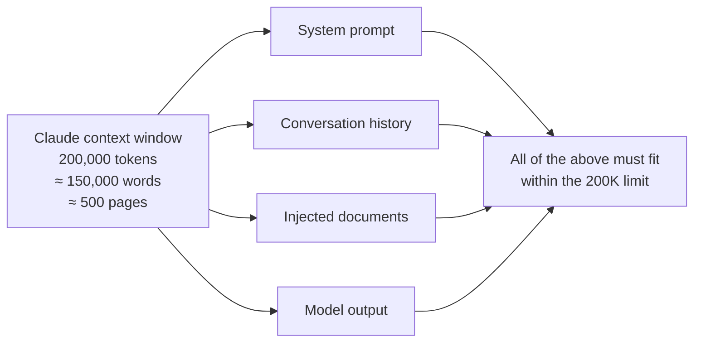

---

## 4. Embeddings

Before tokens enter the transformer, each is converted to a **high-dimensional vector** — a list of floating-point numbers (e.g., 4,096 dimensions for a typical large model). This is the **embedding**.

### Meaning as geometry

```
            ← royalty →
     ^
  M  │         king ●           queen ●
  a  │
  l  │
  e  │  man ●             woman ●
     │
     └─────────────────────────────→
              ← human →

king − man + woman ≈ queen      (vector arithmetic over meaning)
```

This is not metaphor — semantic relationships are literally encoded as directions in vector space. The model learns this geometry purely from predicting next tokens at scale.

### Semantic search via embeddings

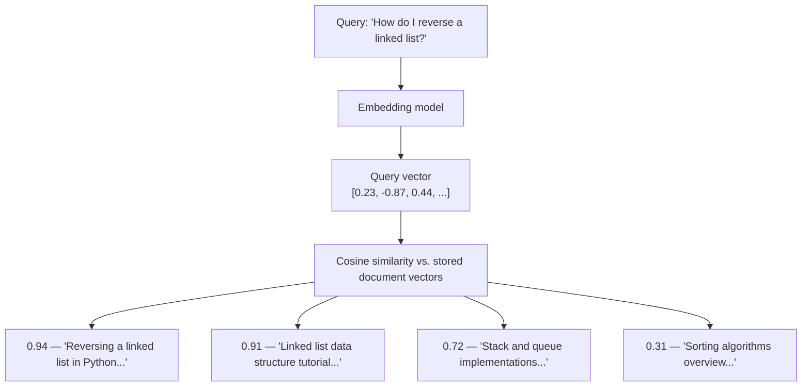

Finding things by *meaning*, not by keyword match — this is the foundation of RAG (Module 7).

### Two types of embeddings

| Type | What it is | Used for |
|------|-----------|---------|
| **Token embeddings** | Learned vectors inside the model, updated during training | Internal representation — not exposed |
| **Document embeddings** | Single vector for a whole passage, from a dedicated embedding model | Semantic search, RAG, clustering |

For RAG and search, you call a dedicated **embedding model** (e.g., `text-embedding-3-large`, `voyage-3`) — separate from the LLM, much cheaper and faster.

---

## 5. How Training Works

### The three-stage pipeline

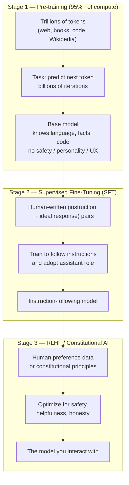

### RLHF in detail

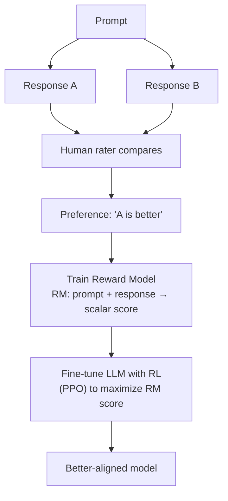

### Constitutional AI (Anthropic's approach)

Instead of relying entirely on human raters, Claude is trained against a set of explicit written principles — a "constitution."

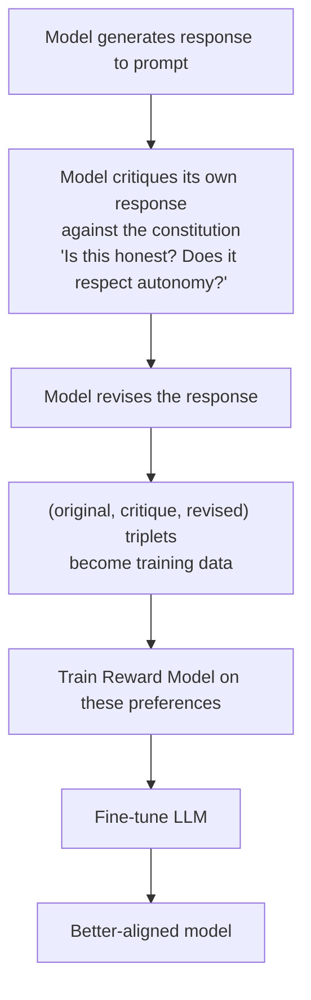

**Why this matters:**
- More scalable than pure human feedback — the model does the critiquing
- Safety principles are explicit, written down, and auditable
- Reduces biases that creep in from human rater inconsistency
- Still anchored by human feedback — just used more efficiently

---

## 6. Model Families

### The landscape (early 2026)

| Provider | Models | Key differentiators |
|----------|--------|---------------------|
| Anthropic | Claude 3.x / 4.x (Opus, Sonnet, Haiku) | Long context (200K), Constitutional AI, strong writing/analysis |
| OpenAI | GPT-4o, o1, o3 | Broad deployment, o-series optimized for multi-step reasoning |
| Google | Gemini 2.0 Flash/Pro | 1M+ token context, native multimodal, Google ecosystem |
| Meta | Llama 3.x | Open weights — run locally, fine-tune freely |
| Mistral / Alibaba | Mistral, Mixtral, Qwen 2.5 | Efficient open models for edge/local use |

### Cost vs. capability tiers

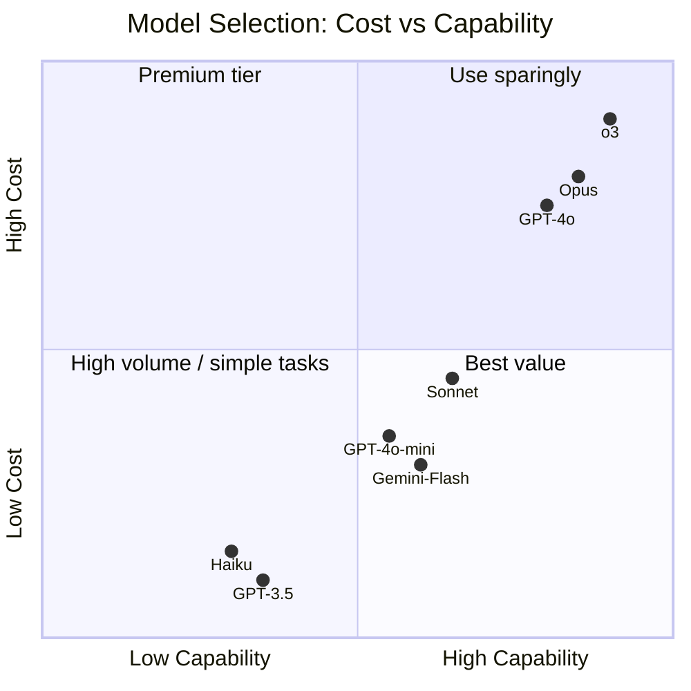

**Rule of thumb:** Start with mid-tier (Sonnet-class). Move up if quality is insufficient. Move down if cost or latency is the constraint. This decision matters enormously in production (Module 11).

---

## 7. Capabilities & Limitations

### What LLMs are genuinely good at

- Pattern matching across a massive knowledge space
- Reformatting, transforming, and synthesizing text
- Writing code in well-represented languages and frameworks
- Explanation and summarization
- Few-shot generalization (show 3 examples — it learns the pattern)
- Format translation: JSON → YAML, English spec → code, etc.

### Fundamental limitations

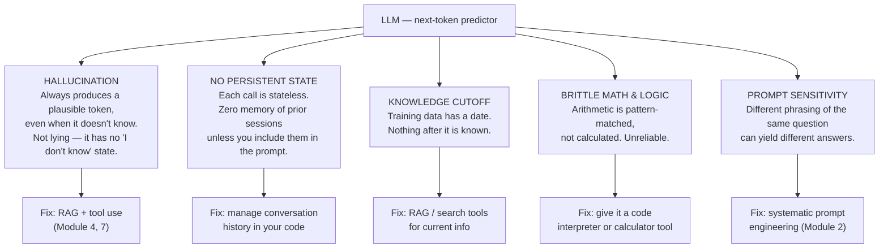

### Hallucination — the deeper picture

This is the most misunderstood limitation. The model is **not lying** — it has no intent. It is completing a statistically plausible token sequence.

```
Prompt: "What papers did Dr. Jane Smith publish on quantum error correction?"

The model has no data on this person.
But the next-token distribution says:
  → a plausible response is a list of papers with plausible titles,
    journal names, years, and co-authors

It generates these with full confidence.
It is not aware it is wrong.
It is doing exactly what it was trained to do.
```

This is a **structural property**, not a fixable bug. The fix is architectural: give the model access to real, verified sources (RAG) or let it call real APIs (tool use) rather than relying on its parametric memory.

---

## 8. Multimodality

Modern frontier models handle multiple input types. Each modality gets its own encoder that converts the raw input into vectors in the same space as text tokens.

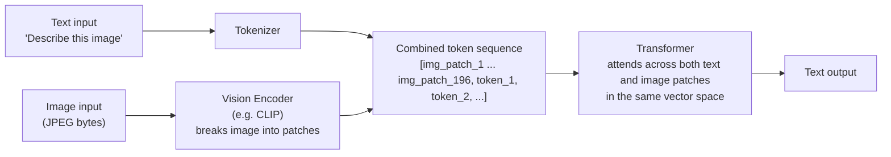

The key insight: image patches and text tokens are **interleaved in the same sequence**. The transformer's attention mechanism works across both without special treatment.

### What's available (early 2026)

| Modality (input) | Availability | Notes |
|-----------------|-------------|-------|
| Text | Universal | All frontier models |
| Images | Widely available | Claude, GPT-4o, Gemini |
| PDFs / Documents | Available | Often via vision encoder on rendered pages |
| Audio | Partial | GPT-4o, Gemini; Claude limited |
| Video | Emerging | Gemini leads; others catching up |

**Generation** (text→image, text→audio) is a separate model class — diffusion models, not LLMs. They are not covered here.

---

## 9. Summary & Key Takeaways

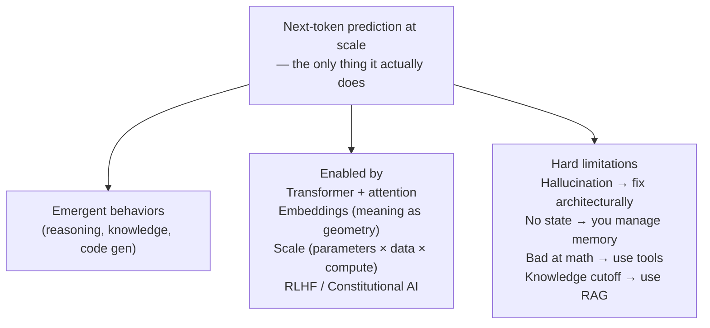

### The single most important practitioner insight

> The model is a statistical completion engine, not a database or a reasoner.
> Every technique you will learn — prompt engineering, RAG, tool use, agents —
> is fundamentally about compensating for or augmenting that core nature.

---

## Drill-Down Topics Available

- [ ] Attention mechanism in mathematical detail (Q, K, V matrices)
- [ ] Tokenization edge cases and cost optimization strategies
- [ ] Hallucination failure modes — a taxonomy
- [ ] Constitutional AI vs. RLHF — deeper comparison
- [ ] Reasoning models (o1/o3, Claude extended thinking) — how they differ architecturally
- [ ] Scaling laws — why bigger reliably means better, and where it breaks down
- [ ] Quantization and inference optimization (how local models run on a laptop)

---

*Next: [Module 2 — Prompt Engineering](02-prompt-engineering.md)*
